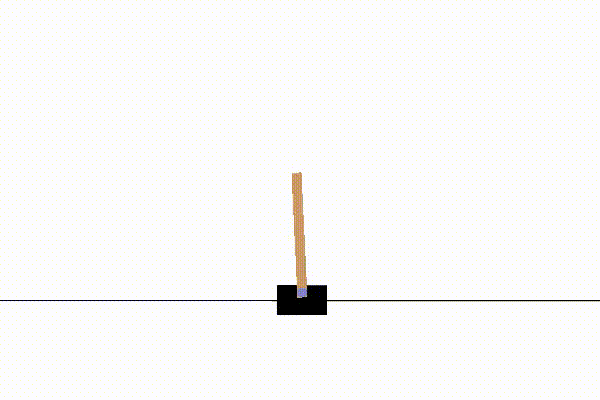

# CartPole-v0 Genetic RL
Using OpenAI's gym environment and PyTorch, I create a basic genetic algorithm reinforcement learning model to solve CartPole-v0. Currently, a model with two linear layers, a ReLU activation function, and a softmax function solves with near perfect success rate in 200 generations.

## The Environment
OpenAI's gym environment provides an ideal way to test machine learning models on simple environments without having to build them or an API beforehand. For the CartPole-v0 problem, the premise is simple, a pole is connected to a block that can move left or right on a 2D plane, the goal is to balance the pole for 195 steps. If the pole falls 15 degrees in either direction, you lose.

## Genetic Algorithm Reinforcement Learning
To solve this problem, I employed a genetic RL model. This model creates X models for Y generations, taking the top Z models of each generation to use as the basis for the next generation. This is a very basic implementation of the genetic algorithm, a much more robust algorithm would include cross-pollination of successful models, single-point crossovers, and a more robust mutation algorithm. Fortunately, the CartPole-v0 problem is simple enough to not need any of these advanced editions and can be solved quite easily with the a proof-of-concept genetic algorithm.

## Results
The algorithm was able to succeed over 50% of the time after roughly 75 generations of 500 population each and near perfect success after 200 generations. In src/saved_models is the most successful model of a 500x500 algorithm; intense overkill, but effective at showing how near-perfect a genetic algorithm can be on such a simple problem. You can view the model's last run before upload on the .mp4 file in src/video/.